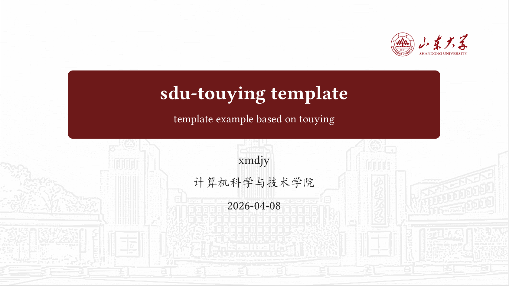
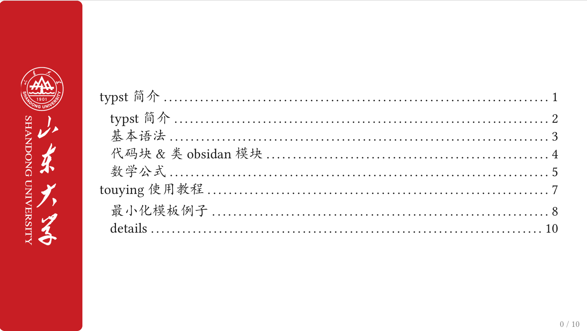
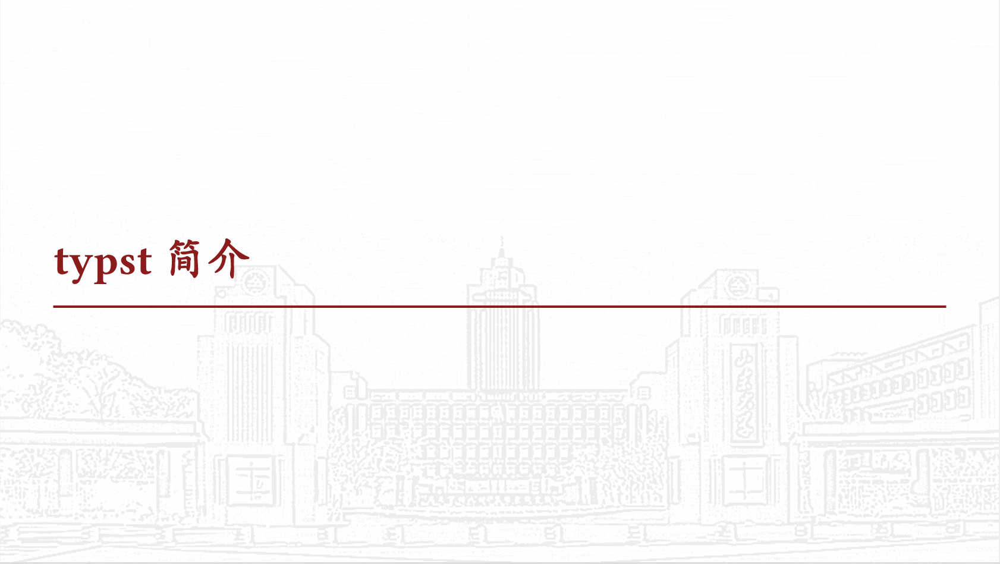
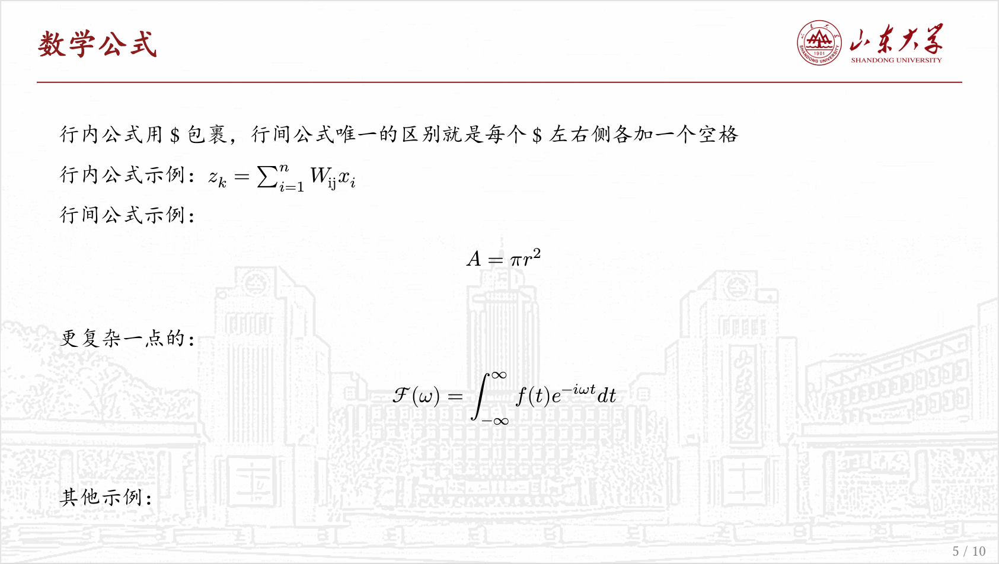

_A simple sdu beamer template made by typst_ \
适合于山东大学的学术汇报的类beamer模板，使用**Typst**编写，基于`touying`修改而来

---
## 效果预览






## 使用说明
(目前尚未上传typst universe,暂时只能通过clone仓库+本地修改编译的方法使用)\
**建议**：你可以安装vscode中的tinymist插件，实时预览&编译你的文件
首先克隆整个项目到本地：
```bash
git clone https://github.com/xmdjy/sdu-touying-template
cd sdu-touying-template
```
新建一个`.typ`文件，建议放在项目根目录下面，并将所有需要使用的图片资源放置到`./image`里面
在typ文件中，复制如下内容：
```typst
#import "@preview/touying:0.6.1": *
#import "../lib.typ": *

#show: sdu-theme.with(config-info(
  title: [主标题],
  subtitle: [副标题],
  author: [作者],
  institution: [单位],
  date: datetime.today(), //时间，这里默认用当天时间
))

#title-slide()

#outline-slide()

== 致谢 <touying:unoutlined>

#end-slide()
```
你需要修改的是theme中的相关信息，其余所有内容写在`#outline-slide()`和`致谢`之间，按照typst语法正常编写即可

## 致谢
本项目参考了[touying-sjtu](https://github.com/sjtug/touying-sjtu)项目同时继承了实验报告模板[exp-report-template](https://github.com/xmdjy/exp-report-template)\
欢迎你的使用和任何bug的反馈！希望给个star